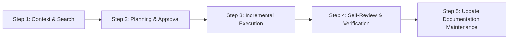

# AGENTS.md - Developer Guidelines & AI Agent Operating Protocol

This document is the mandatory instruction manual for all AI Coding Agents (Cursor, Claude Dev, Roo Code, GitHub Copilot Workspace, etc.) working on this repository. All Agents must adhere strictly to these execution protocols, conventions, and verification steps.

---

## 1. General AI Operating Protocol (Every Task)

AI Agents must follow a strict **Plan -> Execute -> Validate -> Document** lifecycle for every task:

### Phase 1: Context & Search Gathering

- Always response to user in Vietnamese but use English in documentation and implementation.
- Read existing design documents in `docs/`:
  - [docs/game_design_document.md](docs/game_design_document.md)
  - [docs/user_flow.md](docs/user_flow.md)
  - [docs/system_architecture.md](docs/system_architecture.md)
  - [docs/database_schema.md](docs/database_schema.md)
- Locate and understand existing code interfaces, models, and execution flows before generating new files.
- **No Assumptions & Clarification Rule:** NEVER make arbitrary assumptions when requirements, data, or technical specs are incomplete or ambiguous. If information is insufficient, the AI Agent MUST ask the user for clarification before implementation.

### Phase 2: Planning & Approval

- Formulate a clear, step-by-step implementation plan.
- Highlight potential breaking changes, API contract updates, or database schema migrations.

### Phase 3: Incremental Execution

- Implement changes in small, testable, and modular commits/units.
- Never refactor unrelated files, reformat unchanged codebases, or rewrite whole directories unless explicitly instructed.

### Phase 4: Self-Review & Verification

- Run build/compilation checks locally (e.g., `dotnet build` or `npm run build` / `npx tsc --noEmit`).
- Verify that no syntax, typing, nullability, or linting errors were introduced.
- Inspect edge cases, concurrency risks, resource timeouts, and error handling paths.

### Phase 5: Automated Documentation Maintenance (MANDATORY)

- **Rule:** Code and documentation MUST stay 100% synchronized at all times.
- If any DB entity, API contract, state machine, or command interaction flow is added/modified, you **MUST immediately update** the corresponding Markdown file inside `docs/`:
  - Database changes -> [docs/database_schema.md](docs/database_schema.md)
  - UI / Command flow changes -> [docs/user_flow.md](docs/user_flow.md)
  - System / Service changes -> [docs/system_architecture.md](docs/system_architecture.md)
  - Game design / Mechanics changes -> [docs/game_design_document.md](docs/game_design_document.md)
  - *Extensible Mapping:* Any new features, APIs, or architectural additions must update or create their relevant Markdown documentation under `docs/`.

---

## 2. Technology Stack & Coding Conventions

> **Note:** This project is NOT structured as a monorepo with `/bot` and `/api` root directories. The conventions below apply to the respective tech stack components regardless of directory paths.

### A. Node.js LTS / TypeScript / Discord Bot

- **Strict Typing:** Always enforce `strict: true` in `tsconfig.json`. Explicitly type all function parameters, async returns, and event handlers. Do NOT use `any`; use `unknown` or concrete interfaces/generics.
- **Controller Layering:** Keep interaction handlers thin. Route raw interaction events (`interactionCreate`) directly to dedicated controller modules or service clients.
- **Naming Conventions:** `camelCase` for variables/functions, `PascalCase` for classes/interfaces/types, and `UPPER_SNAKE_CASE` for global constants.

### B. .NET (Latest LTS) / C# Core API

- **Asynchronous Operations:** All I/O-bound methods (database, external HTTP) MUST use `async`/`await` with proper `CancellationToken` support.
- **Clean Architecture:** Controllers handle HTTP routing, request validation, and status codes only. All domain calculations, game logic, state machines, and RNG belong in `Core`/`Services` layers.
- **Strongly-Typed DTOs & JSONB:**
  - Use C# `record` or `class` DTOs for API requests and responses.
  - Map PostgreSQL `JSONB` columns to concrete, strongly-typed C# classes. Never store or process raw untyped JSON strings inside domain entities.
- **Naming Conventions:** `PascalCase` for classes, methods, and public properties; `camelCase` or `_camelCase` for local variables and private fields.

### C. Database & Persistence (`PostgreSQL LTS`)

- **EF Core Migrations:** Always generate a new EF Core Migration whenever Entity models change. Direct schema tweaks without migration scripts are strictly prohibited.
- **Optimistic Concurrency:** Any entity subject to rapid mutations (e.g., character stats, currency) must enforce optimistic concurrency control (`xmin` or a `version` column).
- **Domain Constraints:** Enforce domain rules at the DB level (e.g., composite unique index on `(discord_id, server_id)`).

---

## 3. Security, Resilience & Logging Acceptance Rules

### A. Information Leakage & Public Response Masking
- **Sanitized Public Output:** Never expose raw exceptions, stack traces, database queries, or internal IP addresses to Discord Embeds or API clients.
- **Traceable Error Responses:** Always return user-friendly, ephemeral error messages containing a unique `CorrelationId` / `TraceId` for developer log cross-referencing.

### B. Resilience & Crash Prevention
- **Global Exception Handling:** All HTTP API endpoints must be guarded by a Global Exception Handling Middleware returning RFC 7807 `ProblemDetails`.
- **Top-Level Interaction Safety:** Discord interaction handlers must be wrapped in top-level `try/catch` blocks to prevent unhandled rejections from crashing the bot process.
- **Interaction Deferral:** Always handle Discord's 3-second interaction response limit using dynamic `deferReply` calls for async I/O operations.

### C. Structured Logging & Sensitive Data Sanitization
- **Developer Log Sinks:** Log detailed error stack traces, execution context, and parameters strictly to internal server log sinks (e.g., Serilog / Winston).
- **Log Masking:** Automatically sanitize and mask sensitive data (Discord Bot Tokens, Database Connection Strings, JWTs, API Keys, User PII) before emitting log records.

### D. Rate Limiting & Input Validation
- **Input Validation:** Validate all incoming DTO payloads and command parameters strictly before passing them to core domain services.
- **Rate Limiting & Cooldowns:** Enforce command cooldowns and API rate limits to prevent spam abuse and Denial of Service (DoS) attacks.

---

## 4. Definition of Done (DoD) Checklist

An AI Agent must consider a task complete **ONLY when all of the following conditions are satisfied**:

- [ ] Code compiles with zero compilation errors (`dotnet build` / `tsc --noEmit`).
- [ ] Code adheres strictly to the decoupled presentation vs. backend architecture.
- [ ] Exception paths, null checks, and edge cases are handled gracefully without crashing application processes.
- [ ] Public outputs are sanitized (no raw stack traces or internal errors exposed) and detailed logs include trace IDs.
- [ ] Sensitive data (tokens, secrets, connection strings) are sanitized/masked from log outputs.
- [ ] Corresponding Markdown documents inside `docs/` have been updated if code/schema/API changed.
- [ ] A concise summary of changes, build verification results, and updated documentation files is provided to the human reviewer.