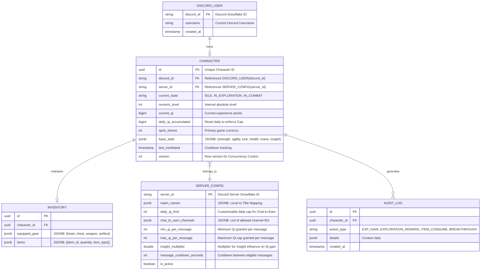

# Database Schema Outline Document - Cultivation RPG Bot (MVP)

This document outlines the relational database schema designed for PostgreSQL. It leverages `JSONB` data types for flexible attributes and inventory management, keeping the database schema lean for the MVP while supporting dynamic server configuration.

## Entity-Relationship Diagram

