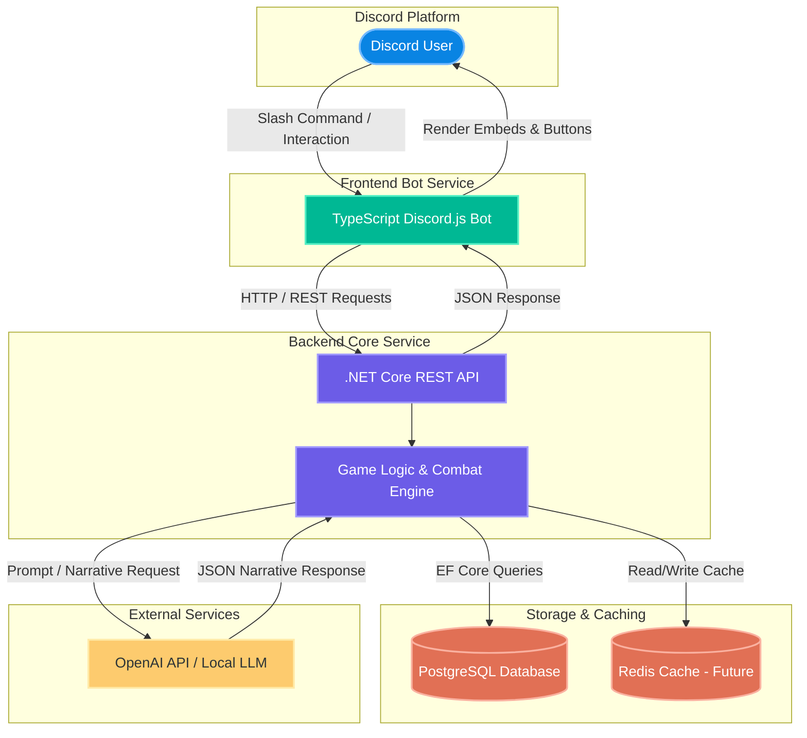

# System Architecture Document - Cultivation RPG Bot (MVP)

This document outlines the technical architecture, layer responsibilities, and data communication flow for the Cultivation RPG Discord Bot. The architecture decouples the presentation layer from backend logic to ensure future web client expansion.

## 1. Technologies

- Frontend: Node.js 24 LTS + TypeScript 5.x + Discord.js v14
- Backend: .NET 10 LTS (C# 13 + EF Core 10)
- Database: PostgreSQL 17 LTS
- Cache: Redis 7.4+
- AI: OpenAI API / Local LLM (JSON mode)

## 2. System Architecture Diagram

