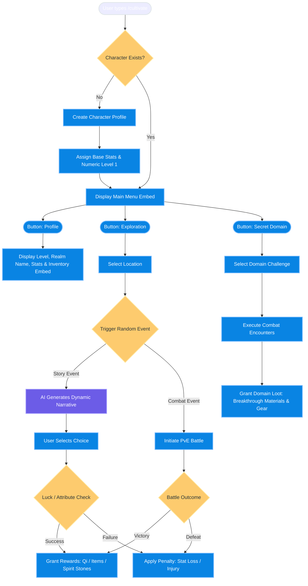

# User Flow Document - Cultivation RPG Bot (MVP)

This document details the user interaction flow for the single-command (`/tutien`) execution model. All actions branch dynamically via Discord Embed interfaces and Interactive Buttons.

## Single-Command Interactive Flowchart

